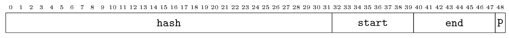
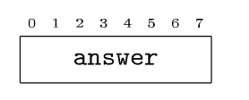

# ByteForce 
### 02159 Operating Systems OS Challenge
<sub>*original repo at https://github.com/likoly/os-challenge-ByteForce*</sub>
___
## Start
To start running the server you need to run the following 

```bash
$ git clone git@gitlab.gbar.dtu.dk:s241783/os-challenge-ByteForce.git
$ cd os-challenge-ByteForce/
$ git checkout FINAL
$ make clean
$ make
$ ./server <port>
```

If you lack any packages required run `./bootstrap.sh` if you are on vagrant, if you are on linux run:

```bash
$ sudo apt update
$ sudo apt upgrade -y

$ sudo apt-get install -y git
$ sudo apt-get install -y libssl-dev
$ sudo apt-get install -y build-essential
```

Also if you are on linux, make sure to edit `$PATHTOCOMMON` in all the bash files to the actual path to the root directory or just remove it, as you are probably in the directory if you run the bash files.

___
## Server Functionality
This server will take a 49 bit request packet



And create an 8 bit response packet 



It will create the struct `request_t` and fill it with the info, hash, start, end, prio, and also client socket (made when connecting to client)

The `hash` is the `answer` run through the sha256 function from the `openssl` library.

Prio is the priority of the request, which adds a weight to the final score.

The start and end create a range of possible answers, to run through the sha256 function to create a matching hash.

When a matching hash is found, the answer will be send back to the client.

___

For testing it is recommended to use port number 5003, or change the port number in `run-client.sh`.

To test run:
First open the server.
```bash
$ ./server 5003
```

Then open a new terminal in root dir and run client.
```bash
$ ./run-client.sh
```
___
## Folder Structure
Client and reference server can be found either in:
`os-challenge-ByteForce/arm64/bin/linux/`
or
`os-challenge-ByteForce/x86_64/bin/linux/`

Csv's created by the submission.py can be found in:
`os-challenge-ByteForce/csv`

Code and results for the tests can be found in:
`os-challenge-ByteForce/tests`

For the testing of algorithms:
`os-challenge-ByteForce/tests/diffQueues/`

For the tests comparing to standard:
`os-challenge-ByteForce/tests/comparedToStandard/`

___
## Server design: 
#### The server uses:
Pthread to do multiproccessing
Cache for to remember the answers that have been send
Queue for to store the requests that need to be sends to the threads.
Priority in the queue, to remove the ones with highest weight first.
SHA256 to bruteforce the correct answer
Server socket to open the server
Listen to find client request packets


___
## Tests
A standard version is added for most tests. The stanard version has the following functions.

| worker | checkCache | addToCache | bruteForceSearch | peek | enqueue | dequeue |
|--------|-------------|--------------|---------------------|------|---------|---------|


The standard has all the base elements of the code, which allows the removal or addition of seperate functions to prove their independent value.
However it does include priority, so proving the effeciency of the queue, is compared to the queue without priority. 
All the tests are made with `run-client-final.sh`, which sends a total of 500 requests, for most reliable results.


___

## Bruteforce (Milestone)
<sub>*Responsible: Nikita*</sub>

Our first implementation (milestone) is a simple multi-process server that listens for incoming client connections and performs a brute-force search to find a key corresponding to a given hash using the SHA-256 hashing algorithm. The server operates as follows:

Signal Handling: The program sets up a signal handler to gracefully terminate the server when a SIGINT (Ctrl+C) signal is received. It ensures that the server socket and any active client sockets are closed before exiting.

Socket Initialization: The server creates a TCP socket and binds it to a specified port (provided as a command-line argument). It sets the socket option to allow address reuse, which helps in avoiding "address already in use" errors.

Listening for Clients: The server listens for incoming client connections, allowing up to 100 pending connections.

Accepting Connections: In an infinite loop, the server accepts client connections. For each accepted connection, it forks a new child process to handle the client, allowing multiple clients to be served concurrently.

Child Process Handling: In the child process:

The server reads a request from the client, which includes a hash and a range (start and end) for the brute-force search.
It extracts the hash and range values from the received data.
The program performs a brute-force search for the key that, when hashed, matches the provided hash. This is done by iterating through the specified range and calculating the SHA-256 hash for each number.
If a matching key is found, it is sent back to the client.
Cleanup: After handling the client request, the child process closes the client socket and exits. The parent process continues to accept new client connections.

___
## Queue

<sub>*Responsible: Søren*</sub>

#### Motivation: 
We want to be able to create a priority queue, so making a queue was the first step. This should also help reduce time, as no new threads have to be created.

#### Functionality:
The queue is an Array queue made from `request_t`, this let's all the requests have an index. The queue is made for requests to wait until they are first in line to be dequed.


#### Test:
To test the efficiency of the queue, we compare the standard without priority (changing peek to FIFO principle), to the standard without `peek, enqueue and dequeue`. 
The server without queue needs to create a new thread everytime a new request comes, compared to the standard that has 7 workerthreads running constantly.


| Category          | Seed 1   | Seed 552012 | Seed 4440  | Seed 5216  | Average    |
|-------------------|----------|-------------|------------|------------|------------|
| No Queue          | 58983552 | 52183147    | 63740600   | 82029478   | 64284194   |
| Standard -Priority | 24299834 | 22540522    | 27567516   | 35083735   | 27372902   |
| Percent Decrease  | 58.81%  | 56.81%     | 56.75%    | 57.23%    | 57.40%    |

Adding a queue meant that there wasn't a need to create a thread everytime there is a new request. This removed a lot of overhead, and completing them one at a time lowered the wait time for each individual request. It also allowed for prioritizing requests as well as optimizing cache.


___
## Queue Priority

<sub>*Responsible: Søren*</sub>

#### Motivation: 
Adding priority to the queue helps remove the higher weighted request and therefor lower the score.


#### Functionality:
The Queue priority happens in peek. It traverses the queue and chooses the request with the highest priority level and returns the index of the request to dequeue.


#### Test:
For this test we run the standard without a priority against the standard.

| Category          | Seed 1   | Seed 552012 | Seed 4440  | Seed 5216  | Average    |
|-------------------|----------|-------------|------------|------------|------------|
| Standard -Priority| 24299834 | 22540522    | 27567516   | 35083735   | 27372902   |
| Standard          | 22267178 | 18310734    | 24255439   | 30542156   | 23843877   |
| Percent Decrease  | 8.37%   | 18.76%     | 12.02%    | 12.86%    | 12.82%    |

Traversing the whole queue to find the highest priority adds a little time, but compared to the chance of about 20%-25% of having a higher priority which are at least double in weight, the extra time required gets dwarfed.

___

## Different Priority Queues:
<sub>*Responsible: Søren*</sub>

#### Motivation: 
Different queues take different time, so we need to find the fastest.

#### Functionality:
The structure of the queue comes at a great importance, some are faster to insert, some are faster to find the highest priority. 
Array for example inserts instantly, but takes time to find the highest priority, and linked list finds instantly but takes time to insert. 

#### Test:
For the test I attempted the following data structures: 
array, linked list and heap.

| Algorithm         | Seed 1    | Seed 552012 | Seed 4440  | Seed 5216  | Average    |
|-------------------|-----------|-------------|------------|------------|------------|
| Array             | 21501411  | 20111300    | 25549377   | 33077915   | 25060001   |
| Heap              | 24402119  | 17772202    | 26179345   | 31919036   | 25018175   |
| Linked            | 25367907  | 21379032    | 26647816   | 35282948   | 27119426   |
| Fastest           |   Array   |   Heap      |     Array  |    Heap    |   Heap     |

When I originally tested it to decide which one to proceed to optimize the array queue was the fastest by more than 15%. However when running the tests a month later, it seems to have evened out and heap was the fastest by a margin, although that might change if more run were implemented.
However the decision to go with Array was still optimal as it is far more readable and easier to use a foundation when adding new features such as checkQueue.

___


## Cache:

<sub>*Responsible: Søren*</sub>

#### Motivation: 
There is a 20% repetition chance of found answers being used again. Therefor it made sense to create an array that stores the hashes and answers that have been completed. As well as adding a cache counter for the size.

#### Functionality:
When an answer is found the answer and hash is saved at index cache count, and the cache count is incremented.

When a new request comes it gets checked if there is a matching hash. This also happens when the request is dequeued, so if the cache has been found in the time from it being enqueued to it being dequeued it will also be send immediatly.


#### Test:

For this test we remove the `cache`, so `checkCache and addToCache`, from the standard. 

| Category          | Seed 1   | Seed 552012 | Seed 4440  | Seed 5216  | Average    |
|-------------------|----------|-------------|------------|------------|------------|
| No Cache          | 58360256 | 58697183    | 60334739   | 67617537   | 61202429   |
| Standard          | 22267178 | 18310734    | 24255439   | 30542156   | 23843877   |
| Percent Decrease  | 61.84%  | 68.80%     | 59.79%    | 54.82%    | 61.03%    |

Adding the cache was expected to maximum do 20% better, but ended up cutting 61% of the time off. This is likely due to the delay between each request, as the server is not just waiting, but actively working meanwhile.

___

## Cache check for Queue:

<sub>*Responsible: Søren*</sub>


#### Motivation: 
Removing request from queue with found answers.

#### Functionality:

After a request has been added to the cache, it will also compare all the hashes of the requests in queue to the hash that was solved. If a matching is found it will put the priority to 20 thereby letting it skip queue and write the answer to the socket immediatly. This happens in the `checkQueue` function.

#### Test:

For this test we add the `checkQueue` function.


| Category          | Seed 1   | Seed 552012 | Seed 4440  | Seed 5216  | Average    |
|-------------------|----------|-------------|------------|------------|------------|
| Standard          | 22267178 | 18310734    | 24255439   | 30542156   | 23843877   |
| Queue Check       | 19688686 | 17879629    | 22368910   | 29578033   | 22378815   |
| Percent Decrease  | 11.58%   | 2.36%       | 7.77%      | 3.16%      | 6.12%      |

Even though it has been tested for 500 request on each seed, the differences between the runs are obvious. This is because `checkQueue` only helps in the single instance where an answer for a request has been found and there is a request with the same hash in the queue.
___

## Experiment 1: Multithreading
### By Nikita Svanholm Alsøer

### Description and Purpose
We are testing if multithreading is faster than using separate processes for handling requests. The multithreaded version, Solution_1, is on the Experiment_1 branch, while the process-based version, Solution_0 (our control), is on the milestone branch.

Solution_0 uses one process to accept requests and forks a new process for each one. Solution_1 works similarly but uses threads instead of processes. Both can handle many requests at once. We think Solution_1 will be faster since creating threads takes less time and memory than forking processes because threads share memory, while processes copy everything.

### Hypothesis
We hypothesize that Solution_1 (threads) will be faster and score lower than Solution_0 (processes). The null hypothesis is that Solution_1 will score higher than or the same as Solution_0, in the test environment.

### Method
The main difference we are testing is whether requests are handled with threads (Solution_1) or processes (Solution_0). The results depend on the scores we get after running a test suite. To keep things fair, we will run all tests with the same settings, random seed, and virtual machine.

To determine which implementation runs faster, we will run run-client-milestone.sh 10 times for each solution, take the average score and compare them. To check if the difference in scores is legit or just random chance, we will also run a hypothesis test with a significance level of 0.05, to confirm whether the difference in scores is statistically significant or not.

### Results
|         | Solution_0 (milestone) |   Solution_1 (threads) |
|---------|------------------------|-----------------------:|
| 1.      |               37872362 |               44208980 |
| 2.      |               43873946 |               41037704 |
| 3.      |               45162787 |               39842148 |
| 4.      |               40021387 |               43116872 |
| 5.      |               37554750 |               39753656 |
| 6.      |               49993490 |               44027742 |
| 7.      |               37655935 |               42560472 |
| 8.      |               42501323 |               43711289 |
| 9.      |               37635655 |               38253498 |
| 10.     |               40308755 |               43116597 |
| Average | 41258039               |             41962895,8 |


### Conclusion
The results indicate that Solution_1 (threads) had a slightly higher average score (41,962,895.8) compared to Solution_0 (processes), which scored an average of 41,258,039. However, this difference is relatively small, and after performing a statistical hypothesis test (one-tailed t-test) at a significance level of 0.05, the p-value was not low enough to confidently reject the null hypothesis. This suggests that the performance difference between multithreading and multiprocessing in this test environment is not statistically significant.

### Discussion
The hypothesis that multithreading would be faster due to its lower memory overhead and faster creation times wasn't strongly supported by the data in this test. The similarity in scores might be due to the specific test environment, such as the number of requests or the virtual machine’s configuration, which may not have fully leveraged the benefits of multithreading. It’s also possible that threading’s shared memory model introduced some synchronization overhead or contention that offset its expected speed advantage.

Despite the lack of a clear performance gain in this scenario, multithreading has other potential advantages, such as reduced memory usage and better scalability under certain conditions. These factors might make it more suitable for different workloads or higher request loads.

___

## Experiment 2v1: Caché
### By Nikita Svanholm Alsøer

### Description and Purpose
This experiment tests whether adding a cache makes handling requests faster. The new version with the cache is Solution_4 (on Experiment_2v1), while the older multithreading solution without a cache, Solution_1 (on Experiment_1), is the control.

Solution_1 uses threads to handle requests as they come in. Solution_2v1 does the same but checks a cache before processing a request. If the value has already been processed, it skips the work and uses the cached result. We think Solution_2v1 will be faster because looking up stored results is way quicker than redoing the work for repeated requests.

### Hypothesis
We predict that Solution_2v1 will score lower (run faster) than Solution_1. The null hypothesis is that Solution_2v1 will either run slower or have the same performance as Solution_1.

### Method
The key difference is whether a cache is used (Solution_2v1) or not (Solution_1). We will measure the client’s returned score after running a test suite. To keep things fair, we will use the same config, random seed, and virtual machine setup for all tests.

To determine which implementation runs faster, we will run "run-client-milestone.sh" 10 times for each solution, take the average score and compare them. To check if the difference in scores is legit or just random chance, we will also run a hypothesis test with a significance level of 0.05, to confirm whether the difference in scores is statistically significant or not.

### Results
|         | Solution_1 (threads) | Solution_2v1 (Caché) |
|---------|----------------------|----------------------|
| 1.      |             44208980 |             38039636 |
| 2.      |             41037704 |             34678151 |
| 3.      |             39842148 |             36612292 |
| 4.      |             43116872 |             36588413 |
| 5.      |             39753656 |             37005056 |
| 6.      |             44027742 |             33306389 |
| 7.      |             42560472 |             34589086 |
| 8.      |             43711289 |             38408213 |
| 9.      |             38253498 |             39809959 |
| 10.     |             43116597 |             38463485 |
| Average |           41962895,8 |             36750068 |

### Conclusion
The results showed that Solution_2v1 scored significantly better than Solution_1. A statistical test with a significance level of 0.05, gave us a p-value of 0.005, so we can confidently reject the null hypothesis. The cache definitely improved performance.

### Discussion
Adding a cache clearly helps in multithreaded setups, especially with repeated requests. It is faster because we avoid reprocessing the same data over and over. The higher the repetition rate, the bigger the improvement. This result not only boosted our project’s performance but also laid a strong foundation for future multithreading experiments.

### Improvements
For future experiments, we could replace the static array with a dynamic one that grows as needed. Even better, switching to a hash table would make lookups and saves faster and more efficient. Another tweak would be implementing locks or time delays when saving values so threads do not mess each other up. This would make the system even more reliable and precise.

___

## Experiment 2v2: Hash Table for Caché
### By Nikita Svanholm Alsøer

### Description and Purpose
This experiment tests whether replacing the cache’s linear array with a hash table improves request handling performance. A hash table offers average O(1) time complexity for insertions and lookups, compared to the O(n) complexity of the current array-based cache in Solution_2v1. This change should make retrieving cached results significantly faster, especially as the cache size grows.

### Hypothesis
We predict that Solution_2v2 (hash table cache) will score lower (run faster) than Solution_2v1 (linear array cache). The null hypothesis is that Solution_2v2 will either run slower or perform the same as Solution_2v1.

### Method
The independent variable is the type of cache used: linear array (Solution_2v1) vs. hash table (Solution_2v2). The dependent variable is the score returned by the client after running the test suite.

To determine performance differences, we ran run-client-milestone.sh 10 times for each solution, calculated the average scores, and compared them. We used the same configuration, random seed, and virtual machine setup to ensure fairness. Finally, we performed a hypothesis test with a significance level of 0.05 to confirm whether the observed differences were statistically significant.

### Results
|         | Solution_2v1 (Caché) | Solution_2v2 (Hash Table Caché) |
|---------|----------------------|---------------------------------|
| 1.      |             38039636 | 38716051                        |
| 2.      |             34678151 | 38270914                        |
| 3.      |             36612292 | 35825471                        |
| 4.      |             36588413 | 38012249                        |
| 5.      |             37005056 | 35465166                        |
| 6.      |             33306389 | 35258995                        |
| 7.      |             34589086 | 38346379                        |
| 8.      |             38408213 | 35749472                        |
| 9.      |             39809959 | 37729261                        |
| 10.     |             38463485 | 35674926                        |
| Average |             36750068 | 36904888,4                      |

### Conclusion
The results showed that Solution_2v2 had a slightly higher average score (slower performance) than Solution_2v1. A hypothesis test with an alpha level of 0.05 confirmed that the difference in scores is not statistically significant (p-value > 0.05). Therefore, we fail to reject the null hypothesis. Replacing the linear array cache with a hash table did not lead to measurable performance improvement in this experiment.

### Discussion
Although hash tables have better theoretical performance for lookups and insertions, this experiment suggests that the hash table's overhead may outweigh its advantages for the relatively small cache size and test conditions we used. The linear array’s simplicity might have been sufficient given the typical number of cache entries, keeping performance comparable.

It is possible that the performance benefits of a hash table would be more apparent under conditions with a larger cache or a higher volume of unique requests. Additionally, implementation details (e.g., hashing functions, collision handling) may have introduced inefficiencies that impacted the results.

This experiment highlights that theoretical efficiency doesn’t always translate to practical gains, especially in specific contexts like ours.

### Improvements
Test with Larger Cache Sizes to better leverage the hash table's efficiency, repeat the experiment with scenarios requiring significantly larger caches.

___

## Experiment 3: Request & Priority Queue
### By Nikita Svanholm Alsøer

### Description and Purpose
The goal here is to make the server handle requests based on priority, using a priority queue (a custom max heap). This builds on Solution_1 (the naive multithreaded version) by improving two things: adding a priority system and limiting the thread pool to match the number of CPU cores to reduce thread switching. We are calling this improved version Solution_3, and it is on the Experiment_3 branch.

In Solution_3, there is one thread that handles incoming requests and pushes them into a max heap priority queue. Four worker threads then pull the highest-priority request from the heap to process. The heap always keeps the highest-priority, oldest request at the top. We use O(log n) operations to insert and remove requests from the heap, which is still super fast since we are dealing with at most ~1000 requests.

We are confident this setup will outperform Solution_1 because it efficiently prioritizes requests while keeping things scalable and reliable.

### Hypothesis
We think Solution_3 (priority queue + thread pool) will run faster and score lower than Solution_1 (no priority queue). The null hypothesis is that Solution_3 will either be slower or just as fast as Solution_1.


### Method
The main difference we are testing is whether the server uses a priority queue to handle requests (Solution_3) or not (Solution_1). We will measure performance based on the score returned by the client after running tests. To keep it fair, we will use the same config, random seed, and virtual machine setup for all tests.

To determine which implementation runs faster, we will run run-client-milestone.sh 10 times for each solution, take the average score and compare them. To check if the difference in scores is legit or just random chance, we will also run a hypothesis test with a significance level of 0.05, to confirm whether the difference in scores is statistically significant or not.

### Results
|         | Solution_1 (threads) | Solution_3 (Priority Queue) |
|---------|----------------------|-----------------------------|
| 1.      |             44208980 |                    26897703 |
| 2.      |             41037704 |                    28122545 |
| 3.      |             39842148 |                    29096425 |
| 4.      |             43116872 |                    29137209 |
| 5.      |             39753656 |                    30244977 |
| 6.      |             44027742 |                    32173072 |
| 7.      |             42560472 |                    26686007 |
| 8.      |             43711289 |                    27859104 |
| 9.      |             38253498 |                    27863965 |
| 10.     |             43116597 |                    29360099 |
| Average |           41962895,8 |                  28744110,6 |

### Conclusion
The results clearly show that Solution_3 (priority queue + thread pool) outperforms Solution_1 (no priority queue), as its average score is significantly lower (28,744,110.6 vs. 41,962,895.8). This indicates that the priority queue and thread pool approach processes requests more efficiently.
To confirm whether the difference is statistically significant, we conducted a one-tailed t-test with a significance level of 0.05. 

The p-value is significantly less than the significance level (alpha = 0.05), so we can confidently reject the null hypothesis. This result shows that Solution_3 (priority queue + thread pool) is statistically faster than Solution_1.

### Discussion
The experiment provides strong evidence that adding a priority queue and a thread pool significantly improves performance, as Solution_3 scored much lower and the difference was statistically significant. This proves that prioritizing requests with a max heap leads to much better performance than just processing them in the order they arrive (FIFO). That makes sense since higher-priority requests get handled faster. We also ran these tests with a configuration similar to the final run, so the results are realistic.

### Improvements
Solution_3 is our best version so far, but it doesn’t handle repeated requests yet. Our next step will combine this priority queue approach with caching from a previous experiment to make it even better.

___

## Race Condition Experiment:
<sub>*Responsible: Chad Lantz S241783*</sub>
#### the motivation
Instead of sequentially working on brute forcing 7 different hashes at the same time my experiment was to work on just one hash splitting up the brute force algorithm amongst 6 threads. The code utilized a internal race-condition in shared memory to efficiently prevent more work from being done then necessary. Each thread is split up covering a different range of the bruteforce hash, terminating when one has reached the right answer. In order to eliminate additional overhead, I made it so that each thread contully ran and was re-assigned instead of tearing down and re-creating each thread for each hash. This Experiment also made sure to incorporate the cache that Soren built to efficiently eliminate the repeating hashes that were received.
#### Test:
We tested this experiment like the others with the same configuration parameters in order to simulate the final parameters on the test.
### Results
| Category          | Seed 1   | Seed 552012 | Seed 4440  | Seed 5216  | Average    |
|-------------------|----------|-------------|------------|------------|------------|
| Standard          | 22267178 | 18310734    | 24255439   | 30542156   | 23843877   |
| Race Condition    | 71627034 | 69933786    | 73865838   | 72572456   | 71999778   |
| Percent Increase  | %321.67  | %381.92     | %304.53    | %237.61    | %301.96    |


The results of this experiment ended up being significantly slower than the standard implementation. 
#### Conclusion
We were able to conclude that the experiment led to a significant increase in completion time, indicating that it is slower to handle single hashes with parallel threads with my implementation. the added complexity and potential thread contention seem to have outweighed the expected performance benefits. A potential reason for this is that one of the threads is left relatively under used, which would account for this increase in time. Another reason that the code is running so much sloweris the race condition is now working to its intended effect adding time to the compuptations.
#### Location
The code for this experiment can be found on the CL/expt3 branch in the server.c file.
___

## Final server:
For the sever we included:

    * BruteForce
    * Pthreads (7 workerthreads)
    * Array Queue
    * Priority in Queue
    * Cache (storage for solved)
    * Cache checker for queue
    * Cache hash map
    
Since they optimized the server